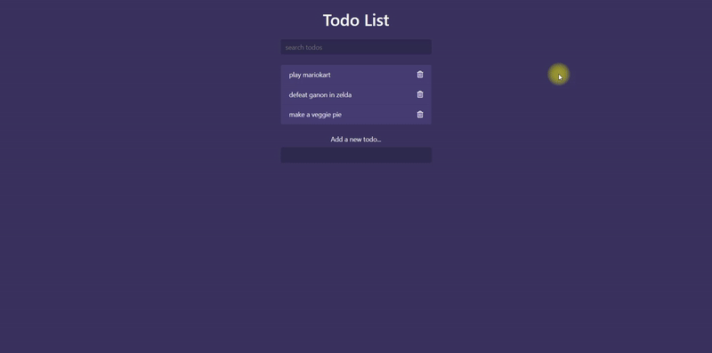

# Todo List Application

This project is a simple, interactive todo list application built using HTML, CSS, and JavaScript. It allows users to add, view, and delete todo items. This application utilizes Bootstrap for styling and FontAwesome for icons, providing a responsive and visually appealing interface.

## Preview

## Features

- Add todo items
- View a list of todos
- Delete todos by clicking the trash can icon
- Filter todos in real-time using the search bar

## Prerequisites

Before you begin, ensure you have met the following requirements:
- You have a modern web browser capable of running HTML5 and JavaScript.

## Installation

No installation is necessary. To run the application, simply open `index.html` in your web browser.

## Usage

1. To add a todo, type in the task in the input field and press enter.
2. To delete a todo, click the trash can icon next to the todo item.
3. To filter todos, start typing in the search bar; the list will automatically filter based on your input.

## Built With

- [Bootstrap](https://getbootstrap.com/) - For styling
- [FontAwesome](https://fontawesome.com/) - For delete icon

